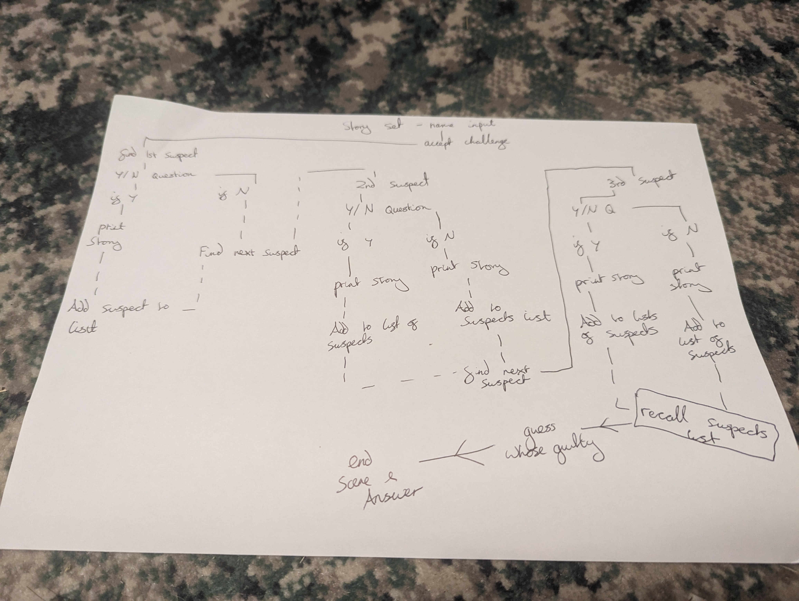
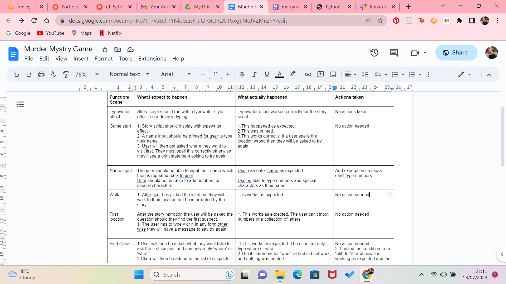
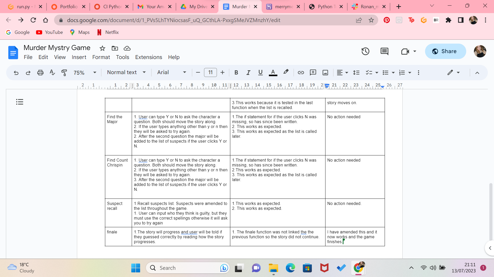
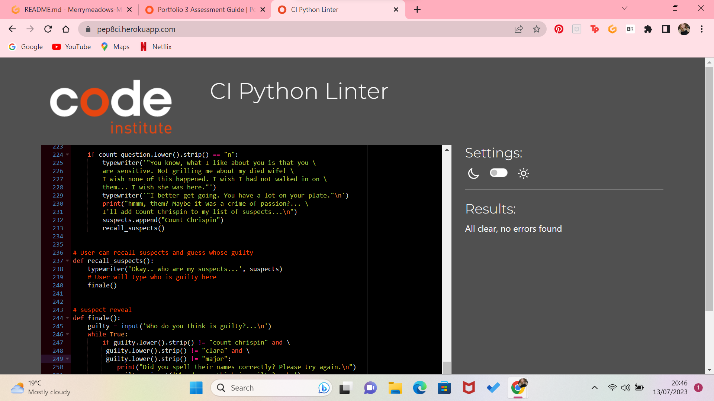

## Project Name : Merrymeadow Mystrey

* [**Project Brief**](#Project-Brief)
My project is a murder mystrey game built in Python. The game is set in the town of Merry Meadow and the murder takes place during the towns funfair to Lady Amara. In this game you inbark on a quest to find out who murdered lady Amara. 

# **TABLE OF Contents**

* [**User Experience** ](#User-experienceX)
* [**User Stories**](#User-Stories)
* [**Wireframes** ](#Wireframes)
* [**Surface-plan**](#Surface-plan)
* [**Features** ](#Features)
* [**Frameworks and libraries**](#Framewores-and-Liberies)
* [ **Testing**](#Testing)
* [ **Deployment**](#Deployment)
* [**Credits** ](#Credits)
* [**Acknowledgements** ](#Acknowledgements)

# User-Experience 
Project Outcomes:

To build a game in python and deploy it to Heroku. 
To show my python skills and understanding in creating this game. 

# User-Stories:
I want to play a line terminal game that's fun and engaging and has some user interation. I want it to allow you to think and make choices.

I want to play a simple murder mystrey game that gives me a chance to guess the characters.

I want to be able to recall my suspects which will help me decide who the murderer is. 

# Features 
A murder mystry game with the following features:
1. To input name.
2. To ask characters questions and travel to different locations in the story
3. To add to the list of subjects.
4. To recall the list of subjects.
5. To find out the winner by if statements.

# Structure-Plan:
I created a flow chart for this game so that I could plan the conditions well and know where the game flow was going. This helped me to write my if conditions. 
Below is the picture of my plan.

# Design-and-Color-Scheme

This game is developed as a line based terminal game, so has little desgin features.
One design effect that I would like to have is for the script to be printed with a type writter effect. This will allow the user to feel like the game is happening in real time, and help with overall engagement.

One thing I would like to add as a future development is different color text for each of the characters so that the user can read the script easily and determine what character is talking.

# Future developments 
1. Font color on the text for different characters. 
2. Place the story into a seperate file and keep the python functions seperate to the story. At the moment the code is long becase of the story, so keeping it seperate would make it more readable.
3. Add a exemption to the name input so that users can't put special characters. This would help to make the game more secure.

# Testing-and-Results 
Strategy:
1. Test game by playing the game.
2. Test each condition by typing in the wrong answers first. This will check if the while loops are working correctly.
3. Play the game to check that the story moves on without ant error. 
4. Check the most recent version has been pushed to Heroku.
5. Pass through a Python Validator with no errors.

You can veiw the results of my testing here on the google document I created.
https://docs.google.com/document/d/1_PVs5LhTYNiocsasF_uQ_GCthLA-PxxgSMeJVZMnzhY/edit?usp=sharing 

Testing Results:

Code was passed through the CI Python Linter validator. 
At first there was issues with white spaces and indentations on most lines. after adding a backslash the code app who show large spaces in the terminal window, so I have since replaced that with an apostrophe to indicate a new line in the print statements.
The code is now fixed with no errors. 

# Deployment 
This Code is depolyed to Heroku. 
To do this I opened an Heroku account and clicked the add app feature. I then linked the account to my git hub pages and deplyed the game.
I clicked automatic deploys so that when I git push to the main it will update in the heroku app as well.

# Credits 

Multi line statement: 
https://www.geeksforgeeks.org/python-multi-line-statements/

For while loops tutorial:
https://www.youtube.com/watch?v=AWcdk5uoxeg

For the typewriter
https://pythonprogramming.altervista.org/typewriter-effect-on-the-console/ 

https://peps.python.org/pep-0008/

Opening story concept:
https://chat.openai.com/ 

# Acknowleadements 

Thank you so much to my mentor Ronan for all your help, guidence and encouragment. Thanks for believeing in me and in my game devlopment dreams!